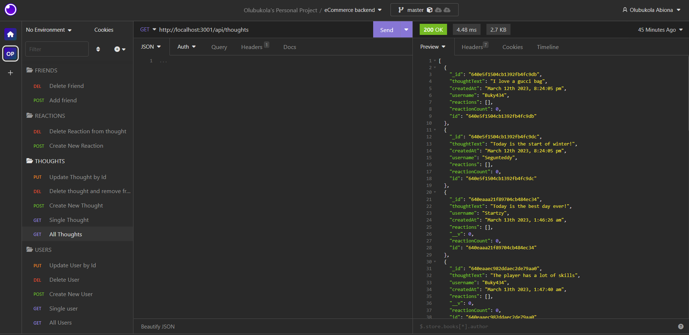

# Social-Network-API
## Description
An API for a social network web application where users can share their thoughts, react to friends’ thoughts, and create a friend list. 

## Table of Contents

- [Description](#description)
- [Technology](#Technology)
- [Installation](#installation)
- [Usage](#usage)
- [License](#license)
- [Contribution](#contribution)
- [Questions](#questions)

## Technology:

The applicaton was created using:

- Javascript
- Node.js
- Express.js
- MongoDB
- Mongoose

## Installation

To run this project, install it locally using npm:

```
npm install
```

## Usage

After installing npm packages, the application will be invoked by using the following command:

```
node index.js
```

#### Walkthrough Video

[Click here to see the demo video ](https://youtu.be/_HNDaqIrWAk)

#### Insomnia Screenshot



## License

[](https://opensource.org/licenses/MIT) <br>
This project is licensed under MIT, for more information please visit [this website](https://opensource.org/licenses/MIT)

## Contribution

Made by Olubukola Abiona

## Questions?

Please feel free to contact me if you need any further information:

- [Email](mailto:bukyabiona@gmail.com)
- [Github Profile](https://github.com/buky-js)